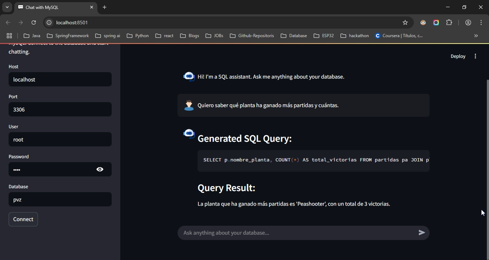

# 💬 Chat with MySQL

An interactive **Streamlit** application that connects to a **MySQL** database, allowing users to ask questions in natural language and receive both the corresponding **SQL queries** and query results.

---

## 🚀 Features

- 🔒 Connect to a MySQL database using host, port, user, password, and database name.
- 🧠 Translates questions in Spanish into valid SQL queries.
- 🛠 Automatically executes the generated SQL statement.
- 📊 Displays the query results in a clear and readable format.
- 🤖 SQL assistant-like interface for real-time interaction.

---

## 🖼️ Screenshot



---

## 🛠️ Requirements

- Python 3.8 or higher
- MySQL Server (local or remote)
- Active database connection

---

## 📦 Installation

1. **Clone the repository:**

```bash
git clone https://github.com/your-username/chat-with-mysql.git
cd chat-with-mysql
```

2. **Install the dependencies:**

```bash
python -m venv .venv
.venv\Scripts\activate.bat
pip install -r requirements.txt
```

3. **Run the application:**

```bash
streamlit run chat-with-mysql.py
```

---

## 🧪 Dependencies

- [streamlit](https://streamlit.io/)
- [mysql-connector-python](https://pypi.org/project/mysql-connector-python/)

Add this to your `requirements.txt`:

```txt
streamlit
mysql-connector-python
```

---

## 💡 Example Usage

1. Fill in the connection credentials in the sidebar.
2. Ask a question like:  
   `"Quiero saber qué planta ha ganado más partidas y cuántas."`
3. The app will generate the corresponding SQL and show the query results.

---

## 📁 Project Structure

```
📁 chat-with-mysql
├── chat-with-mysql.py
├── README.md
├── query-samples.txt
├── requirements.txt
├── .env
└── img/
```

---

## 🤖 Credits

This project was built as a conversational SQL assistant, ideal for students and developers who want to interact with databases more intuitively.

---

## 📜 License

MIT License.